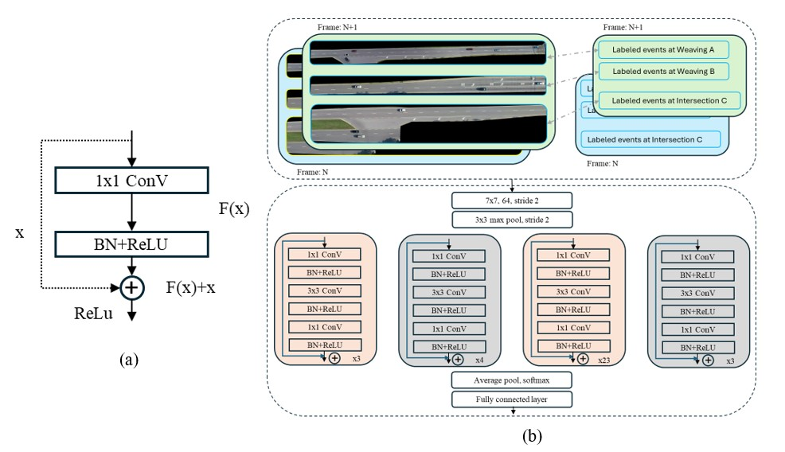
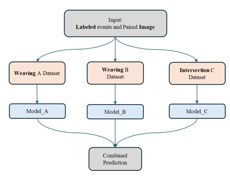
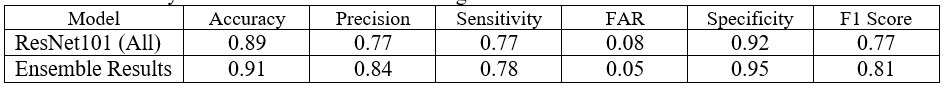

# Conflict_detection by using deel learning model

# Objective
### Real-time traffic conflict detection is critical to intelligent traffic safety systems. However, real-time large-scale conflict estimation is still challenging due to high-efficiency requirements. To tackle this challenge, we propose a novel approach leveraging deep learning models for real-time conflict detection. 

# Methodology

### Data preprocessing
We divided drone videos into sequential frames and paired consecutive frames as input for deep neural networks. Conflict events, estimated by conflict measure, are labeled as learning outputs. Time to collision (TTC) is used as an alternative metric for conflict detection, and the data is processed by selecting the minimum TTC within each frame to identify conflicting events. In order to avoid the heterogeneity of driving behaviors and traffic flows in different areas, the ensemble method is applied to train three types of segments (weaving A/B and intersection C), separately. 

### ResNet
ResNet101, a variant of the Residual Network (ResNet), is a deep convolutional neural network (CNN) consisting of 101 layers. Introduced by He et al. (20), ResNet addresses the degradation problem found in deep networks by incorporating shortcut connections, or residual blocks, that allow gradients to propagate more effectively during training. 
Formally, denoting the desired underlying mapping as H(x), we let the stacked nonlinear layers fit another mapping of F(x)=H(x)-x. The original mapping is recast into F(x)+x.
Figure 2 illustrates the architecture of a ResNet101 model and its application in this study based on labeled image data. The upper portion of the image depicts the data preprocessing workflow, which includes video frames from multiple traffic intersections (Frame N and Frame N+1) with annotated specific traffic events (such as "Labeled events at Weaving A/B" and "Labeled events at Intersection C"). The conflict is identified based on the TTC metric, which requires the relative distance and speed between two vehicles, so we concat two images together and create a new image with 6 channels as input data. The lower portion of the image presents the ResNet101 network structure, including an initial 7x7 convolutional layer (outputting 64 channels, stride of 2), a 3x3 max-pooling layer (stride of 2), and multiple residual blocks. Each residual block consists of a 1x1 convolutional layer, a 3x3 convolutional layer, and another 1x1 convolutional layer, interspersed with batch normalization (BN) and ReLU activation functions. The function of BN stabilizes and accelerates the training of deep neural networks by normalizing the inputs of each layer, resulting in faster convergence, improved training stability, and better overall performance. These blocks are repeated 3 times, 4 times, 23 times, and 3 times, respectively, followed by an average pooling layer, a softmax layer, and a fully connected layer, The output feature maps of the final convolution or pooling layer is usually flattened in which every input is connected to every output by a weight. 

Figure 2 ResNet101 Deep Learning Model (a) A Building Block in Residual Network (b) The ResNet101 model architecture

### Ensemble method
Ensemble methods are advanced machine learning techniques that combine the predictions of multiple models to improve overall performance (24). 
Figure 3 presents an ensemble method designed for traffic event prediction using labeled events and images. The process begins with the input of labeled events and corresponding images. This input data is then categorized into three distinct datasets based on the type of traffic event: Weaving A, Weaving B, and Intersection C. Each dataset is tailored to train a specific model, ensuring that each model is optimized for its respective event category. The data preprocessing phase is crucial, as it ensures that each subset of the data is relevant to the specialized task of its corresponding model. The Weaving A dataset is used to train Model_A, the Weaving B dataset trains Model_B, and the Intersection C dataset trains Model_C. Each model is thus able to learn the unique characteristics and patterns of its specific event type, leading to more accurate predictions within its domain. Once the individual models are trained, their predictions are aggregated to form a unified, combined prediction. Ensemble confusion matrix was applied to aggregate results to leverage the strengths of each model. By combining the predictions from Model_A, Model_B, and Model_C, the ensemble method aims to improve overall predictive performance by reducing variance and bias that might be present in individual models.

Figure 3 Ensemble Method

# Model Performance
The results on the testing set are promising, achieving 91% detection accuracy, 84% precision, and 81% F1 score, outperforming models trained on all images together. A key advantage of our approach lies in its efficiency during inference without trajectory processing, requiring only milliseconds, thus enabling real-time conflict detection. Additionally, this method avoids data heterogeneity issues from diverse sensor inputs. This work opens up opportunities for large-scale real-time conflict computation, which is critical for intelligent urban traffic safety management solutions.

